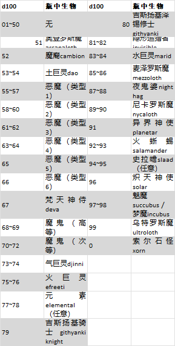

# 附录C：存在位面The Planes of Existence

D\&D的大宇宙中充斥着众多各不相同的世界，它们以不同的异次元多维空间存在，或称之为**存在位面planes of existence**。其中也包括了相对平凡的物质位面，即DM通常用以主持冒险的所有世界。在这之外的则是属于原始的元素物质和能量之界域，纯粹思维和理念的国度，或是恶魔与天使的居所和诸神的领域。\
&#x20;许多法术和魔法物品能够从这些位面中获取能量，召唤那里栖息的生物，并与这些位面住民交流或是让冒险者穿梭去该处。随着角色能力和等级的提升，你们也许会需要前往恐怖的深渊之中营救一名伙伴，或是与约瑟园友好的巨人们举杯共饮。你们会在固态火焰的街道上行走，或是在那每日破晓都会有亡者复生的战场上彰显智勇。

## 物质位面The Material Plane

&#x20;物质位面充满了凡俗的生命与平凡的物质，是构成其它位面的精神力与元素力交杂而成的存在物。所有奇幻游戏世界都存在于物质位面中，因此其真是大多数游戏战役的起始地。而多元宇宙中的其他事物都以它们与物质位面的关联而确立。\
&#x20;物质位面的世界是无限丰富的，它们反映的是设定该游戏的DM以及控制角色冒险的玩家们灵活多变的想象力。这里有被魔法摧毁的荒芜星球，有岛屿散布的汪洋世界，有魔法与科技并存或永远在石器时代的世界，还有诸神遍行或被诸神遗弃的世界。\
&#x20;多元宇宙中最为著名的是那些多年来作为官方战役设定发布的世界——包括灰鹰Greyhawk、黑沼Blackmoor、龙枪Dragonlance、被遗忘国度Fogotten Realms、密斯塔拉Mystara、天赋神权Birthright、浩劫残阳Dark Sun以及艾伯伦Eberron。这些世界中都有属于自己的一批批英勇冒险家和狡诈恶徒，都有各自的古老遗迹和失传的神器，以及各自的龙与地下城。而当你们在其中某个世界展开战役时，其将由DM掌管——你们可以将其想象成以该世界为基础，成千上万平行世界的其中之一，这样的世界有时可能与出版物中的内容不太相同。

### **物质映射Material Echoes**

&#x20;物质位面是个充满魔力的地方，其魔法本质体现于与之共享多元宇宙中心的另两个位面。妖精荒野和堕影冥界是占据了相同宇宙空间的两个平行维度，它们往往被称作映射位面或称为物质位面的镜像位面。二者的世界和地貌仿造自物质位面的自然环境，但表现出来的形态却各有不同——在妖精荒野中会显得华美奇妙，而在堕影冥界则显得扭曲暗淡。物质位面上的一座火山，在妖精荒野中是一座高耸入云的水晶的山峰，其内还闪耀着火柱；而在堕影冥界，山顶则会是一块突出的骷髅状粗糙岩壁。\
&#x20;_**妖精荒野Feywild，**_也称作妖精位面Plane of Fearie，是一片光怪陆离的大地，其内聚居住着充满热切渴望的小人，同时还是音乐与死亡的领域。这里永远处在黎明的辉光中，点缀着在柔风中摇曳的灯火，其下的林地与原野间还穿行着巨大的萤火虫。天空由朝阳亦或是落日的余辉照亮，而太阳静挂空中永不升起或落下，低沉而昏暗地映在天边。在远离喜乐廷Seelie Court辖区的土地上，是蔓延着尖锐荆棘和粘稠的沼泽——正是哀怒精类Unseelie天赐的狩猎场。由_召唤林地之精Conjure Woodland Beings_及类似法术召唤来的精类生物都居住于妖精荒野。\
&#x20;_**堕影冥界Shadowfell，**_也称幽影位面Plane of Shadow，是一个光线阴暗之地，其内一切暗淡失色只剩黑白灰。这里弥漫着扼杀光亮的恶毒黑暗，其天空也是一座不见日月星光的漆黑穹顶。

**正负位面Positive and Negative Planes**

&#x20;**正位面Positive Plane**如同穹顶一般罩在其它位面上方，它是充盈着由卑微到高贵，所有生命的光耀能量和原始生命力之源。它的黑暗面是**负位面Negative Plane**，那里是摧毁生命以及创造不死生物的死亡能量之源。

## 物质界外Beyond the Material

&#x20;物质位面之外的诸多存在位面是神秘与传说的国度。它们不是单纯的异界，而是由普通世界抽象出的精神和元素的基本法则所主控的相异存在。

### **位面旅行Planar Travel**

&#x20;冒险者前往其它存在位面去完成任务，经历的是一次穿越现实与神秘边界的传奇旅程。这样的旅行是神话传奇的素材。他们在死者国度中的探险，在火巨灵家乡与其进行的谈判，都足以编成歌谣和故事代代流传。\
&#x20;想要前往远离物质位面的诸位面，其方法有两种：法术或位面传送门。\
&#x20;_**法术Spells**_。某些法术可以直接或间接地连通其他存在位面。位面传送Plane Shift和异界之门Gate能够以不同的精准度将冒险者直接送往另一个存在位面。以太化Etherealness能够让冒险者进入以太位面，进而从那里前往毗邻的其他位面——如幽影荒原、妖精荒野、或是元素位面。星界投影Astral Projection能将冒险者投影到星界从而传送去外层位面。\
&#x20;_**传送门Portals**_。传送门是对连接两个位面特定地点的不动型跨位面链接的统称。传送门有时像门窗，或像烟雾缭绕的通道，当被穿过时便会激活其位面传送功能。另一些则是特殊地点（诸如石碑阵、高塔、航船、甚至是整个城镇），这些地点可能同时存在于多个位面，亦或者不断地在一个又一个位面间切变。还有一些是一股涡流，它们往往链接着物质位面和相应元素位面类似的区域，例如火山中心（前往火元素位面）或是海洋深处（前往水元素位面）。

### **中转位面Transitive Plane**

&#x20;以太位面和星界位面被称作中转位面。它们几乎毫无特征，而只为了联通不同的位面而存在。以太化和星界投射这样的法术可以使冒险者进入中转位面，进而访问在远方的其他位面。\
&#x20;**以太位面Ethereal Plane**是一片云雾笼罩的空间，有时也会被比作一片汪洋。而汪洋的海岸则称为“以太边界Border Ethereal”，物质位面和内层位面在此处与以太位面重叠，因此这些位面中的每一个地点在以太位面中都有一处与之对应。一些生物能够以视觉看穿以太边界，而识破隐形see invisibility和真视术True Seeing也能提供这种能力。某些魔法效应能从物质位面延伸进以太边界，其主要是一些力场能量效应，例如魔力牢笼Forcecage和力场墙Wall of Force。以太位面的深处，一片笼罩着迷雾和彩烟之地则被称为深以太。\
&#x20;**星界位面Astral Plane**是思想和梦境的世界，造访者们离体的魂魄在期间穿行，前往神圣或魔性的位面。这里是一片没有上下之分广袤无垠的银色海洋，混杂着灰与白的游光如同远星的光点在其间穿梭，变化莫测的彩色漩涡像旋转的硬币般在半空中闪动。这里除了偶尔出现的小块固态物质外，大部区域都是宽广开阔的领域。

### **内层位面Inner Planes**

&#x20;内层位面包覆着物质位面和它的映射位面，提供了组成所有世界的基础元素物质。气、土、火、水四个**元素位面Elemental Planes**在物质位面外形成一个环，悬浮在翻滚的**元素混沌Elemental Chaos**中。\
&#x20;在这四个元素位面最接近物质位面的内侧边缘（概念而非具体位置上来讲），它们都会表现出物质位面中的某个世界。这里四种元素如同在物质界中一般交汇在一起，形成了土地、海洋和天空。然而，元素界远离物质位面的地方既怪异又危险。元素在这里以其最纯粹的形态呈现出来——大面积的坚实土地、炙热火焰、澄澈水流和无垢气团。这些区域少有人知晓，也正因此，比如人们在说到火元素位面时，讨论的也往往只是边界区域。内层位面最遥远的区域中，纯粹的元素融合交汇在一起形成了一片能量和物质冲击碰撞的无尽喧嚣，即是元素混沌。

### **外层位面Outer Planes**

&#x20;如果内层位面是多元宇宙的物质和能量来源，外层位面就构成了它的方向、思想和目的。相应地，贤者们往往将外层位面称作神圣位面、精神位面或神之位面，因为这里正是众所周知的众神居所。\
&#x20;在讨论神祇的时候，使用的语言只能是高度隐喻性的，众神的居所并非任何地点，而是对外层位面作为思想和精神世界的印证。与元素位面相似，你可以将外层位面可感知的部分想象成它的边界区域，而高度精神化的区域潜藏于正常感官所能触及的范围之外。\
&#x20;即便是在可感知的区域中，表象往往是有误导性的。外层位面一开始会让物质位面的旅者感到适宜和熟悉。但这景观可以随着外层位面居住的强大力量的意愿而改变。居住在这些位面的强大力量可以随着自己的喜好将位面完全重塑，将存在本身抹消、重建，从而满足他们的需求。

外层位面中，距离是一个毫无意义的概念。可感知的外层位面也许非常小，但它们也能仿佛无穷无尽般地延伸。如果炼狱的势力们愿意，你可以在带领下一天内游览完九狱。而有时，旅行者们将在某一层上艰难探寻数周之久。\
&#x20;比较有名的外层位面一共有十六个，对应着八大阵营（绝对中立除外）和他们之间的差别。

#### **外层位面Outer Planes**

| **外层位面**                         | **阵营** |
| -------------------------------- | ------ |
| **天界山Mount Celestia**的七层天堂       | LG     |
| **双生天堂Bytopia**的孪生伊甸             | LG,NG  |
| **极乐境Elysium**的祝福之地              | NG     |
| **万兽园The Beastlands**的无尽荒野       | NG,CG  |
| **奔放之野Arborea**的奥林匹亚林地           | CG     |
| **约瑟园Ysgard**的英雄领域               | CG,CN  |
| **混沌海Limbo**的永恒混乱                | CN     |
| **喧癫空隧Pandemonium**的风啸深渊         | CN,CE  |
| **无底深渊the Abyss**的无限层域           | CE     |
| **卡瑟利Carceri**的流放深渊              | CE,NE  |
| **哈迪斯Hades**的灰色荒野                | NE     |
| **焦炎地狱Gehenna**的永恒旷野             | NE,LE  |
| **九层地狱the Nine Hells**（巴托Baator） | LE     |
| **修罗场Acheron**的地狱战场              | LE,LN  |
| **机械境Mechanus**的钟表涅槃             | LN     |
| **世外桃源Arcadia**的和平国度             | LN,LG  |

&#x20;包含有善良成分的位面被称为**上层位面Upper Planes**，其间居住着天使、飞马这样的天界生物。包含有邪恶成分的位面被称为**下层位面Lower Planes**，居住着恶魔、魔鬼还有尤格罗斯魔这样的邪魔。每个位面的阵营是它的本质，一名与位面阵营不符的角色在其间会感到极端不适。比如当一名善良生物访问极乐境Elysium时，它可以感觉到与这个位面的调合，而邪恶生物就会感到格格不入以及明显的不适。

### **其他位面**

&#x20;在各已知位面的间隙或是远离其他位面之处，某些位面以某种形式存在着。

#### **印记城和外域Sigil and the Outlands**

&#x20;在外层位面之间的位面称作外域Outlands，这里是中间状态的位面，却并非空无一物的状态。其内反而是万事万物都参杂其中，并互相之间矛盾般的对立抗衡却一致地共存着。这里是一处地形多变的宽广领域，有开阔的草原、高耸的山脉、蜿蜒而低浅的河流，俨然物质位面的一个普通世界。\
&#x20;外域是个圆环，如同一个巨轮。而事实上，认为整个外层位面是个巨轮的人也正是以外域的形态支持其论点，并将其称作诸界的缩影。这一论述确实有点本末倒置，不过，也许正是外域的形状本身先启发了巨轮理论Great Wheel的提出。\
&#x20;在圆的外围均匀排布着一些**门镇Gate-town**：也即是十六处聚居地，其中每处都建立在一座通往某个外层位面的传送门周围。每个城镇都具有当地传送门对应位面的诸多特征。\
&#x20;外域中心的无极尖峰Spire犹如位面巨轮的轮轴一般延伸至难以言喻的高度。在这单薄的顶峰上漂浮着的是环状城市众门之城City of Doors：印记城Sigil。这个喧嚣的位面都市潜藏着无数通往其它位面和世界的传送门。\
&#x20;印记城是一个商业城市。货物、商品和情报从诸界汇聚于此。位面间的情报交易行当兴隆，其中关于各种传送门的命令语和启动物品的情报尤为热门。传送钥匙极为宝贵，许多城中的旅人都在寻找某个传送门或传送钥匙来继续他们的旅途。

#### **半位面Demiplanes**

&#x20;半位面是有自己规则的小型异次元空间。它们构成现实中不存在于任何地方的部分。半位面可以通过多种途径产生,有些是通过类似创造半位面demiplane的法术产生，有些也可以通过强大神祇或其它势力创造。半位面可能是作为多元宇宙中被剥离的一部分自然存在，也可以是某个正在成长的幼年宇宙。一个已知的半位面可以通过它与其他位面的一个连接点进入。理论上来说，法术位面传送plane shift可以将旅行者带入某个半位面，但要抓准其如音叉般一一对应的频率却很难做到。而施术者知晓作为目的地的半位面时，则使用异界之门Gate更为可靠。

#### **遥远国度The Far Realm**

&#x20;遥远国度存在于已知宇宙之外。实际上它可能本身就是另一个多元宇宙，甚至有着自己的物理和魔法规律。遥远国度逸出的能量流入另一个位面时，生命和物质会被扭曲变幻为违背一般几何学和生物学的怪异形态。\
&#x20;驻留在遥远国度的存在实体实在过于怪异，以至于会对其所接触的普通心智直接造成损害。巨大的生物在虚空中游动，其内里却充盈着疯狂。不可名状之物向任何胆敢聆听者呢喃着恐怖的真实。而凡人所认知的遥远国度，是个心智凌驾于物质与空间，乃至凌驾于理智的界域。\
&#x20;没有任何已知的传送门可以通向遥远国度，至少现存能运转的门确实都无法去到那里。远古时代的精灵们曾使用炎爆峰Firestorm Peak中的巨大传送门洞穿了亘古恒存的界壁，连接到了遥远国度之中，他们的文明也随之在血淋淋的恐怖中崩塌，而传送们的地点也连同其所在的世界一起被遗忘于历史长河。其它的一些传送门也许仍然存在，甚至还一直向物质位面泄露着异界之力，并在不断制造腐蚀的同时形成一道标记。
